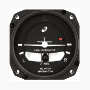

Quiz: 
* In a turn, you must **apply back pressure on the elevator**
* **Attitude indicator** is used to verify and crosscheck the attitude of the airplane
* **The relationship between a point on the airplane and the horizon** is the primary reference for attitude when looking outside the airplane
* **The attitude** is the position of the airplane relative to the horizon.
* **The wings of the miniature airplane of the turn coordinator** is the primary reference for attitude when looking inside the airplane.
* 
* 

## Chapter 1. Introduction to Flying
## Chapter 2. Aeronautical Decision-Making
## Chapter 3. Aircraft Construction
## Chapter 4. Principles of Flight
## Chapter 5. Aerodynamics of Flight
## Chapter 6. Flight Controls
## Chapter 7. Aircraft Systems
## Chapter 8. Flight Instruments
## Chapter 9. Flight Manuals and Other Documents
## Chapter 10. Weight and Balances
## Chapter 11. Aircraft Performance
## Chapter 12. Weather Theory
## Chapter 13. Aviation Weather Services
## Chapter 14. Airport Operations
## Chapter 15. Airspace
## Chapter 16. Navigation

### Abbreviation & Acronym
* GS: groundspeed GS determines the time the flight will take. -> gas consumption
* TAS: true airspeed no wind -> true airspeed == ground speed
* WCA(Wind Correction Angle):  
### Concepts 
* **Pilotage**: navigation by reference to landmarks or checkpoints
* **Dead Reckoning**: navigation solely by means of computations based on time, airspeed, distance, and direction. the products derived from these variables, when adjusted by wind speed and velocity, are heading and GS.  
* **Variation**: the angle between TN and magnetic north(MN).
* **Course**: Intended path of an aircraft over the ground
* **Heading**: Direction in which the nose of the aircraft points during flight
* **Track**: 

* **Magnetic Deviation**:  
### Key Points
* Timezone -> sunset time
* Wind Triangle / Vector Analysis -> determine the heading 
* Flight Planning

## Chapter 17. Aeromedical Factors
