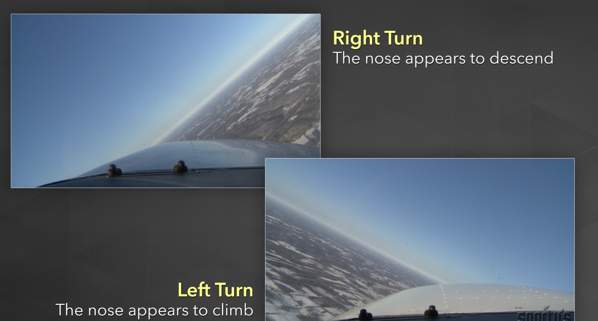
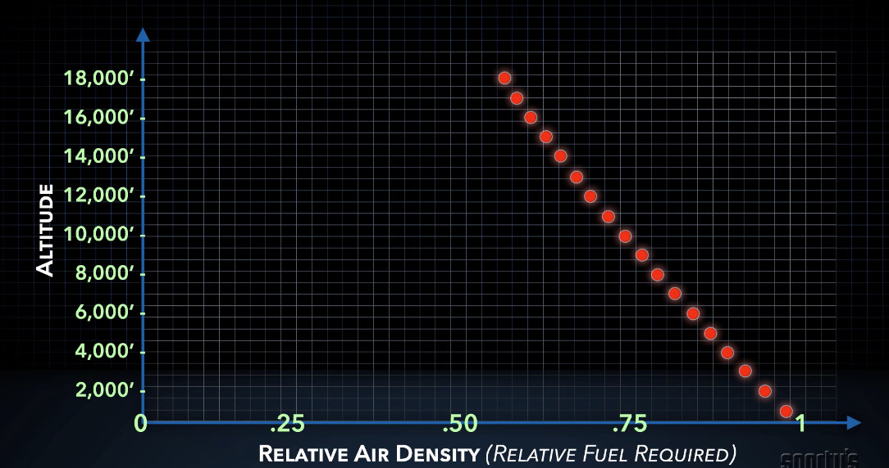
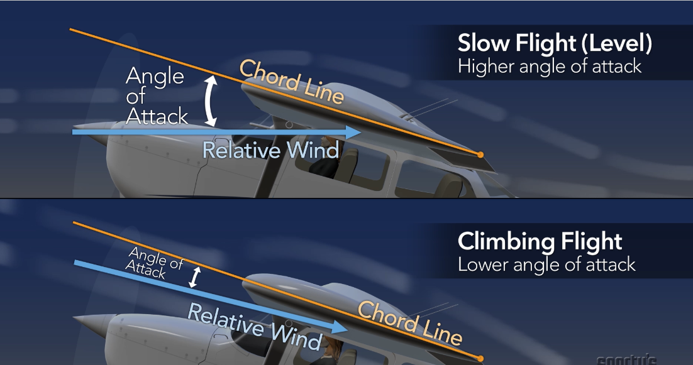
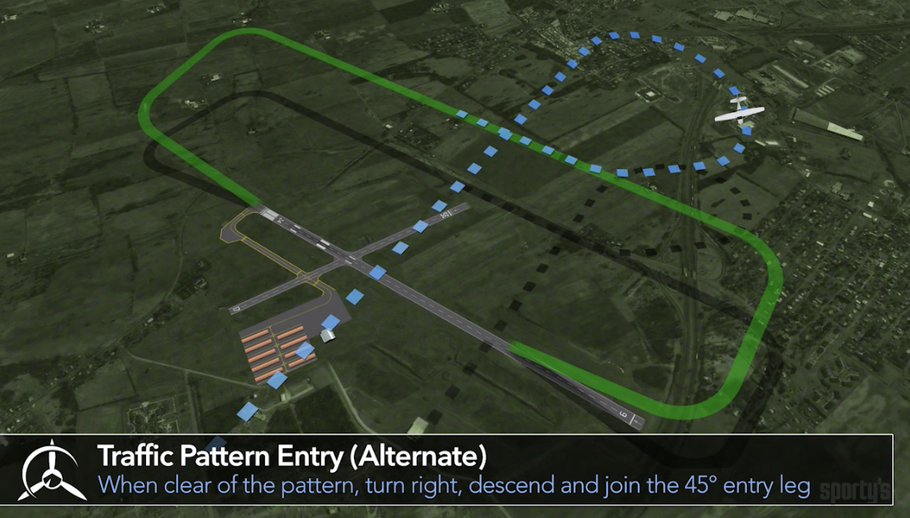
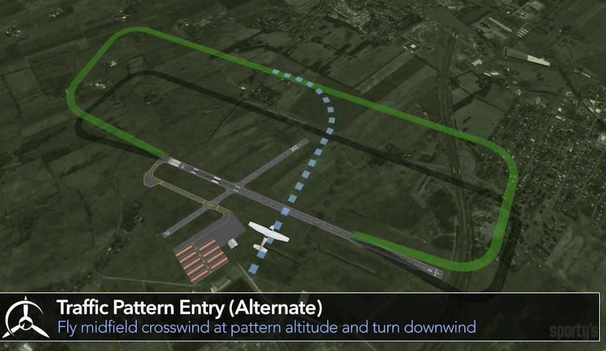
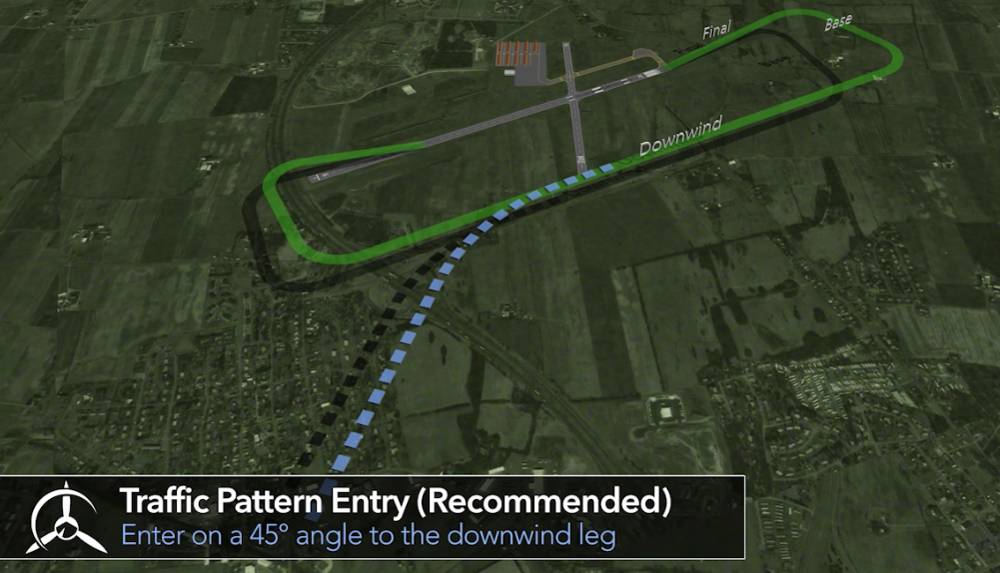
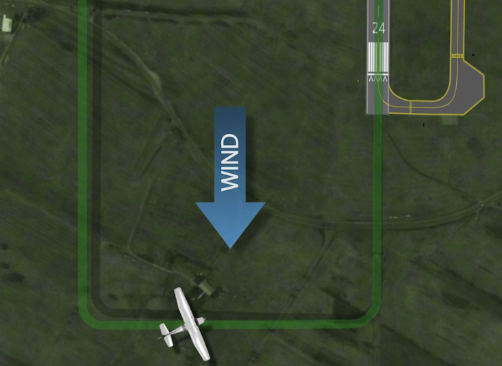
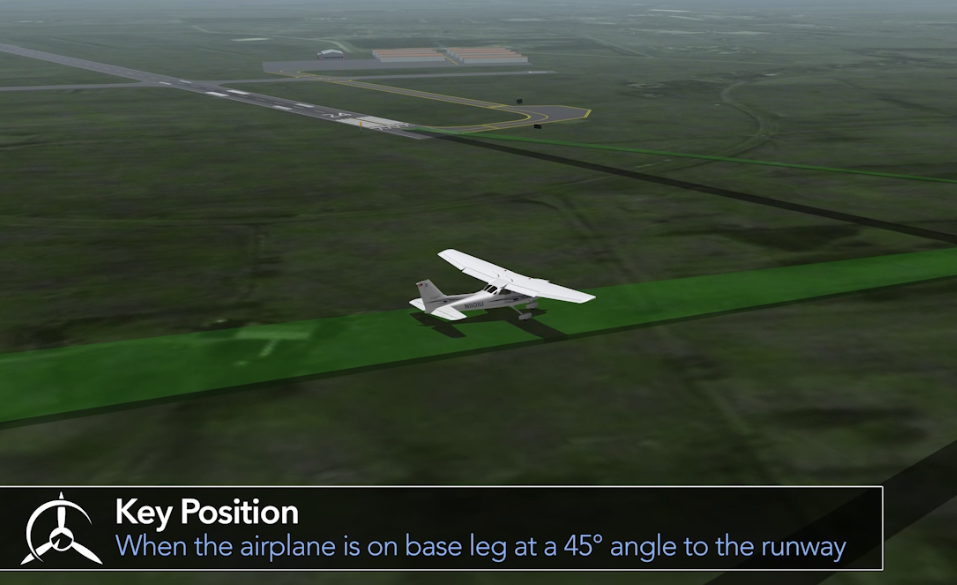
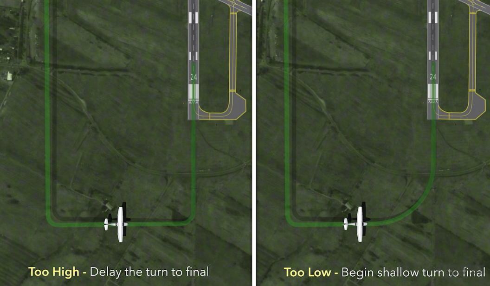

## 1. Your First Few Hours

### 1. Into / The Flight

### 2. When Should You Fly? 
### 3. Air Facts: Weather Geeks
### 4. Introduction to the Airplane
### 5. Closer Look: Training Airplanes
### 6. Introduction to the Cockpit
### 7. Closer Look: Cockpit Variations
### 8. Introduction to Airplane Engines
### 9. Air Facts: Engine TLC
### 10. Propeller, Fuel and Electrical System 
### 11. Closer Look: Carbureted Engines
Carburetor heat: 
* Heated air melts ice
* Slight power loss

heat is coming from exhuast systgem

pull out => full carburetor heat
Carburetor Icing: Likely with high humidity, temperatures < 70 F and low power settings 

small drop in engine RPM , less dense air. roughly first, after the ice has melted, and the water is exhausted from the engine, the RPM will increase . use carburetor heat routinely when operating the engine at lower RPMs, like ruing descent, approach and landing. This is done as a preventative measure to ensure carburetor ice does not form at the reduced throttle settings. 

### 12. Air Facts: Purposeful Preflight

### 13. Preflight

### 14. Engine Start

确保飞机后面没人 没有遮挡 风大可能会有damage

a matter of courtesy and safety as well

### 15. Aviation Communications

nine -> niner

five -> fif

three -> tree 

Altitudes, ceiling heights, and large numbers are pronounced in hundreds and thousands

*  9,500' `Niner Thousands Fife Hundred`
* 12,500' `One Two Thousands, Fife Hundred`

Altitude above eighteen thousand feet are indicated as a flight level: 

* e.g. FL350 -> 35,000'  Flight Level Tree Fife Zero

Course / Heading / Wind Direction 一个一个蹦

Heading 180: One Eight Zero

Wind Direction: 270 Two Seven Zero 

Airspeed: 120 knots -> One Two Zero knots 

直接读数字的情况

* Traffic Clock： Twelve O'Clock 
* IFR Vector: Vector 12 -> Vector Twelve\

Roger 只是表示你收到了上一条消息，不能回答YES / NO 等需要确认的问题, 如果要回答YES -> Affirmative , 回答No -> Negative

CTAF: Common Traffic Advisory Frequency: 

### 16. Air Facts: Getting the Message

### 17. Taxi, Run-up, Traffic Pattern

Runway Magnetic Heading

rounded off to the nearest ten degrees, and dropping the last zero

Each direction is referenced to the north, northeast is 45 degrees,  

### 18. Closer Look: Wind Direction Indicators

Wind Sock: funnel shape device, the large open end faces into the wind -> think of the airplane taking off and landing from the small to the large end of the wind sock.  That would equate to flying into the wind. 

Wind Tee: same direction as wind tee is pointing 

Wind Tetrahedron: narrow tip of the tetrahedron points into the wind 

### 19. Takeoff

### 20. Closer Look: Tower Controlled Field

### 21. Air Facts: Takeoff Tips

* make sure the sky is clear
* directional control 
* achieve the proper pitch altitude

### 【核心重点】22. Four Fundamentals

Turns / Straight & Level / Climb / Descent

Airplane Control:

* pitch
* bank
* Power 

Shallow bank turn(less than 20 degree): less than 20 bank -> require the holding of control pressure to keep the airplane from returning to wings level flight 

Medium bank turn (between 20 and 45 degree) -> the airplane will tend to stay in the bank without aileron pressure

Steep turns (over 45 degree) -> the overbanking tendency of the airplane requires holding aileron pressure against a steep turn to prevent the bank from increasing. 

Roll out

* Shallow: 10 
* Medium: 15
* Steep: 25 

Balance the turn:

* Rudder too soon -> nose turns before the bank starts

* Rudder too late -> nose doesn't turn (or turns in the opposite direction)
* Elevator too much back pressure -> pitch attitude moves up when entering a bank
* Elevator not enough elevator -> nose moves down when entering a bank 

### 23. Air Facts: Pitching and Turning

### 24. Four Fundamentals (part 2)

### 25. Air Facts: The Proper Attitude

### 26. Conclusion 

## 2. Practicing Landings

### 1. Ground Reference Maneuvers

TODO: 重新练习和思考 如何crab the airplane 

### 2. Closer Look: Taxi Tips
concentrate eyes outside

* 提前设定好GPS / Radio / Phone 不要在taxi的时候干别的

### 3. Engines

越高的altitude 空气越少 需要lean the mixture 来维持更好的油气燃烧比

用75 % 或者 80% max 的power 然后再lean

enrich the mixture before full power, 右到左

detonation + pre-ignition 提前点火了 都可以通过power loss 来发现问题 通过cool the engine 来解决

### 4. Air Facts: Engine Suspicion

### 5. Aerodynamics

* 考点: 
  * Angle of Attack 
  * Stall
  * left tendency 
    * spiraling slipstream
    * P-factor: Asymmetric propeller loading:  右边向下打的螺旋桨有更高的 AOA  Desceding propeller blade has higher AoA than ascending blade in a climb -> high AoA means high thrust 向前的力更大 右半边更容易向前移动 

where it's moving 和 where it's pointing to 之间的夹角

### 6. Closer Look: Angle of Attack
### 7. Slow Flight
### 8. Closer Look: Change of Scenery 
### 9. Stalls

Imminent Stall: 刚刚感觉到了Stall 就进行recover 没有Nose down

Full Stall: 整个的nose down + lose altitude 

影响Stall Airspeed 和 Pitch Level的因素:

* weight
* bank level
* power setting
* load factor

Stall angle of attack 是保持一致的

### 10. Air Facts: Stall Rhetoric
### 11. Normal Landings

进入Pattern的方式

* Cross midfield 500 feet above pattern altitude,  turn right 270 and join downwind

  

* Cross midfiled at pattern altitude, turn left 90 and join downwind

  

* fly at pattern altitude and 45 entry join downwind

从Downwind 到 Base turn 是要大于90度的 因为有Crosswind 

Key position: 在Base 45度的位置 可以判断是否要 Begin the Turn or Delay the turn

一进final 立刻Full Flap 来固定glide path 根据Aiming Point 来进行调整

Pitch for altitude, Power for airspeed. 

never below approach airspeed

Variables

* Wind: 
* 

什么时候不要Full Flap ?  Crosswind 10 degree on downwind, 20 degree flap on final 

### 12. Air Facts: Down to Earth

### 13. Takeoff & Landing Variations
### 14. Nontowered Airport Communications
### 15. Wake Turbulence Avoidance

## 3. Your First Solo

### 1. Pre-Solo Maneuvers

### 2. Closer Look: International Flight Training

### 3. Steep Turns

### 4. Closer Look: Touch and Go

### 5. Emergencies

### 6. Air Facts: Emergencies

### 7. Fog & Atmospheric Pressure

### 8. Closer Look: Atmospheric Pressure

### 9. The Pitot Static System

### 10. Closer Look: Pilot's Operating Handbook

### 11. METARs and the Weather Depiction Chart

### 12. Terminal Aerodrome Forecast

### 14. Intro to Glass Cockpit Systems

### 15. Runway Safety

### 17. Thunderstorms and Convective Forecasts

**Concept**

* fronts: 
* pre-frontal squall lines
* updrafts & downdrafts
* hail:冰雹 hailstone:  a round ball of [ice](https://simple.wikipedia.org/wiki/Ice) which falls out of a [storm](https://simple.wikipedia.org/wiki/Storm) [cloud](https://simple.wikipedia.org/wiki/Cloud)

Three conditions to create a thunderstorm:

* unstable air
* high moisture content
* source of lift

Thunderstorm lifecycle:

* start as cumulus clouds and consist entirely of updrafts
* start of the mature stage begins when the first precipitation falls from the cloud and is characterized by both updrafts and downdrafts. 
* In the mature stage, downdrafts grow in size and occupy the entire cell, the thunderstorm starts to dissipate

### 18. Radar Imagery

### 19. Drag

Induced Drag: By-product of lift

Parasite Drag: 

* Form (profile)
* Skin Friction
* Interference

Drag is produced by moving the airplane through the air, and is considered to act parallel to the relative wind and rearward. 

Form drag increase approximately as the square of the speed increases

Induced drag remains the same regardless of speed changes.

### 20. Closer Look: Reducing Drag

### 21. Thrust, Stability & Center of Gravity 

Effects of the lift and the center of gravity as they relate to stability

properly load an airplane vs. consequences of improper loading 

maneuverable , controllable and stable  相互矛盾

more stability = less maneuverable 

we can affect stability by the way we load the airplane

dihedral:  

what is dihedral ?

lateral / roll stability 

directional stability: 保持直线 

pitch stability: nose up / down

roll stability: 从bank角度 恢复到水平

fuselage: the main body of an aircraft

Positive dihedral: wing tips is higher than the wing root

If an airplane is banked without turning, it tends to side slip toward the lowered wing. because of the dihedral, the lowered wing has a higher angle of attack and produces more lift. This tends to return the airplane to the original wings level position. making it stable. 

**Quiz:**

For 

Q: Lateral or roll stability is normally achieved by

A: The upward pitch of the wings, called dihedral.

Q: Lateral or roll stability is normally achieved by:

A: The upward pitch of the wings, called dihedral.

Q: For directional stability, an airplane tends to weathervane back to a stable position due to: 

A: More fuselage aft of its CG.

### 22. Flight Service Weather Briefings

### 23. Closer Look: Graphical Forecast for Aviation 

### 24. Federal Aviation Regulations

### 25. Air Facts: Eye to the Sky 

### 26. Student Pilot & Medical Certificate

### 27. AirFacts: Fit for Flight

### 28. Solo 

## 4. Your Dual Cross Countries

### 1. Night Flying

### 2. Air Facts: The Night Shift

### 3. Publications and Charts

### 4. Air Facts: Where Is It Really

### 5. Flight Planning and Computations

### 6. Cross-Country Flight Planning with iPad

### 7. Air Facts: Leave Yourself an Out

### 8. VOR Navigation

### 9. Global Positioning System(GPS)

### 10. Glass Cockpit Flight Instruments

### 11. Closer Look: Airport Services

### 12. Air Masses and Fronts

### 13. Closer Look: Weather Information 

### 14. Weather Forecasts and PIREPs

### 15. Closer Look: Tablets in the Cockpit

### 16. The Dual Cross Country Flight

### 17. VFR Flight Following 

### 18. Sporty's E6B: Flight Planning and FAA Test Prep

### 19. Normal Airspace

* Class A Airspace (18,000' MSL - FL600(included)) 29.92 pressure 
  * Operating Requirements
    * All flights must be on an **IFR flight plan**
    * Instrument Rating required
    * Obtain an ATC Clearance before entering Class A
    * Maintain 2-way radio contact
* Class B Airspace (大城市机场) 29.92 pressure 
  * Operating Requirements
    * ATC Clearance
    * Maintain 2-way radio contact
    * Requires Mode C Transponder with ADS-B Out capabilities
  * Student Pilot Operations
    * Requires ground and flight instruction on operations in the specific Class B airspace
    * Logbook Endorsements: 
      * operate within specific Class B airspace
      * to takeoff or land at specific Class B airport
      * valid for 90 days
  * minimum VFR visibility
    * 3 sm + clear or clouds
* Class C Airspace (18,000' MSL - FL600(included)) 29.92 pressure 
  * Operating Requirements
    * No ATC Clearance
    * Establish communications with ATC 
    * Minimum of a **Student Pilot Certificate**
    * Mode C Transponder with ADS-B Out capabilities
  * minimum VFR visibility
    * 3 sm + 512
* Class D
* Class E
  * 可能会到700 看sectional chart 是否标记出来
  * 10,000' MSL 是VFR weather的分界线  
* Class G
  * uncontrolled area 1000

### 20. Special Use Airspace

Prohibited Areas

Restricted Areas

Warning Areas: international area

Military Operations Areas(MOA) 

Alert Areas

Controlled Firing Areas

Military training routes

* VR: Visual Training Route
* IR: Instrument Training Route
* 3 Digit Route IR109: Above 1,500
* 4 Digit Route Below 1,500

Temporary Flight Restriction(TFR): Restrict flight operations to protect persons or property in the air and on the ground

TFR sources 

Parachute Jump Areas

### 21. Airspace Preflight Planning 

### 22. Wrap Up - Going Places

## 5. Your Solo Cross Countries

### 1. ATC Radar Services

### 2. Air Facts: Getting to Know You 

### 3. Magnetic Compass

### 4. Closer

### 5. Performance Charts

### 6. Air Facts: When Enough's Not Enough
### 7. Flying to a Towered Airport
### 8. Max Performance Takeoffs and Landings
### 9. Closer Look: ADS-B

### 10. Federal Aviation Regulations
### 11. Cloud Formations
### 12. Atmospheric Stability
### 13. Air Facts: Laying a Foundation
### 14. Winds Aloft, AIRMETs and SIGMETs
### 15. Closer Look: The Standards (ACS)
### 16. Basic Intrument Flying
### 17. Air Facts: Calm in the Clouds
### 18. Flying Out of Trouble
### 19. Closer Look: ASOS: Behind the Scenes
### 20. Lost and Found
### 21. ForeFlight Weather Imagery
### 22. Closer Look: Self-Serve Fuel

