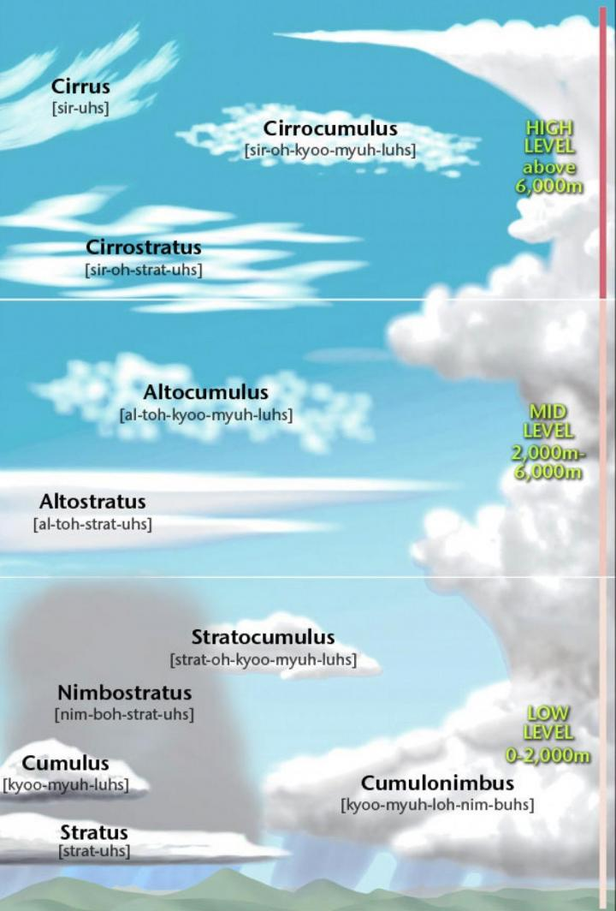

## 各种缩写

* AGL: Above Ground Level 应用 6500AGL 云层 
* MSL: Mean Sea Level true altitude/elivation 和海平面的差 绝对海拔
* FL: Flight Level e.g. FL350: pressure altitude of 35,000'

## 

## Airport Operation 

### Airspace

https://www.youtube.com/watch?v=c6ZieuNvjHw 

https://www.youtube.com/watch?v=V_AgxK9JQVU 

### Airport Markings

https://www.youtube.com/watch?v=MrrL92AH23A

Runway number 是指向那个方向的 取最接近的十位数 273 -> Runway 27  278 -> Runway 28

Magnetic 

called:Runway two seven

Runway edges

threshold

touchdown zone 

pilots aiming point

Displaced Threshold 

Runway 用数字

Taxiway 用字母

### Airport Signage

https://www.youtube.com/watch?v=VCDo9xJk4YE

### Airport Lighting

Airport Beacon 

VASI(Visual Approach Slope Indicator)

runway center line: green light

https://www.youtube.com/watch?v=FSl8iIpeHEk

## Weather

Cloud can be good indicators of the type of weather going on. Clouds are the visible collection of minute ice or water particles suspended in the air. 

Videos

* What is a Cloud? Crash Course Geography #10 https://www.youtube.com/watch?v=EK_UOLsN72Q&list=PL8dPuuaLjXtO85Sl24rSiVQ93q7vcntNF&index=12

### **Words & Concept**

* Cloud 
  * stratus
  * cumulus
  * cumulonimbus: 积雨云 cumulus
* Temperature inversion: the temperature increases with altitude and results in a stable atmosphere. 
* Atmosphere
  * Stratosphere: Second layer of the atmosphere
  * Tropopause: boundary between troposphere and stratosphere
  * Troposphere: temperature decreases with altitude
* Dew point: the temperature to which air must be cooled to become saturated by the water already present in the air
* Atmospheric Stability: the resistance of the atmosphere to vertical motion
* 
* Moisture: 
  * Evaporation: liquid to vapor
  * Condensation: vapor to liquid
  * Sublimation: solid to vapor
  * Deposition: vapor to solid
  * Freezing: liquid to solid
  * Melting: solid to liquid

Cloud Wiki: https://simple.wikipedia.org/wiki/Cloud

* Layered clouds: stratus 层云 indicate stable conditions, expect a relatively smooth flight, with fair to poor visibility. 
* Cumulus clouds 卷云 are those with vetical development. A cumulonimbus cloud is a cumulus cloud which is producing precipitation. -> expect a bumpy flight with good crisp visibility. Rain or snow is usually heavy and localized. They indicate that the air is unstable, thus the bumpy ride. 

Moisture: 

* Moisture can be added to the air by either evaporation(liquid to vapor) / sublimation(solid to vapor)

* Moisture is removed from the air by either condensation(vapor to liquid) / deposition(vapor to solid)

Fog conditions that produce fog

* Small temperature/dew point spread -> 形成水滴
* Winds are calm or light -> 不能被吹散
* Precipitation is continuous -> 持续不断新的水汽来源
* Condensation nuclei are abundant
* Cooling processes are active

Fog Types

* Radiation fog (Ground fog): forms on a clear, cold night when the surface of the earth is cooled by raidation until the temperature of the air near the surface is below initial dew point. Cooling of the air causes fog to form.  common night or early morning
* Advection fog (Sea fog): occurs mostly along coasts and is caused by wind transporting warm moist air to a colder surface. e.g. 墨西哥湾的暖风会在美国东部形成大雾 widespread, long-lasting, day or night 
* Upslope fog: caused by wind forcing moist stable air up a sloping land surface. 
* Precipitation induced fog: caused by the evaporation of rain or dizzle. 
* Ice fog

Altimeter indications 

altimeter measures the cahnge in atmospheric pressure and reads it out in feet of altitude.  1 inch of mercury = 1000 feeet of altitude below 10,000 feet. It's important to reset the altimeter periodically as you fly to keep it accurate. 

Temperature affects the altimeter because the atmosphere expands and contacts with changes in temperature. 

"High temperatures to low, look out below" because the aircraft is lower than the altimeter indicates. 

"Low temperature to high, look to the sky"

The reverse of high to low is also true. 

* If you fly from a low pressure to a high pressure area without resetting the altimeter, you will have the aircraft higher than the altimeter indicates. 
* Flying from cold to high temperatures will also put the aircraft higher than the altimeter indicates. 

Fronts: The boundary layer between two types of air masses 

Fronts Type

* Warm Front:  暖锋
* Cold front
* Stationary front
* Occluded front: 移动快的冷锋 把移动慢的暖锋挤掉

Wind Shear

Thunderstorm

* 

## 1. Your First Few Hours

### 1. Into / The Flight

### 2. When Should You Fly? 
### 3. Air Facts: Weather Geeks
### 4. Introduction to the Airplane
### 5. Closer Look: Training Airplanes
### 6. Introduction to the Cockpit
### 7. Closer Look: Cockpit Variations
### 8. Introduction to Airplane Engines
### 9. Air Facts: Engine TLC
### 10. Propeller, Fuel and Electrical System 
### 11. Closer Look: Carbureted Engines
Carburetor heat: 
* Heated air melts ice
* Slight power loss

heat is coming from exhuast systgem

pull out => full carburetor heat
Carburetor Icing: Likely with high humidity, temperatures < 70 F and low power settings 

### 12. Air Facts: Purposeful Preflight

### 13. Preflight

### 14. Engine Start

### 15. Aviation Communications

### 16. Air Facts: Getting the Message

### 17. Taxi, Run-up, Traffic Pattern

### 18. Closer Look: Wind Direction Indicators

### 19. Takeoff

### 20. Closer Look: Tower Controlled Field

### 21. Air Facts: Takeoff Tips

### 22. Four Fundamentals

### 23. Air Facts: Pitching and Turning

### 24. Four Fundamentals (part 2)

### 25. Air Facts: The Proper Attitude

### 26. Conclusion 

## 2. Practicing Landings

### 1. Ground Reference Maneuvers
### 2. Closer Look: Taxi Tips
### 3. Engines
### 4. Air Facts: Engine Suspicion
### 5. Aerodynamics
### 6. Closer Look: Angle of Attack
### 7. Slow Flight
### 8. Closer Look: Change of Scenery 
### 9. Stalls
### 10. Air Facts: Stall Rhetoric
### 11. Normal Landings
### 12. Air Facts: Down to Earth
### 13. Takeoff & Landing Variations
### 14. Nontowered Airport Communications
### 15. Wake Turbulence Avoidance

## 3. Your First Solo

### 1. Pre-Solo Maneuvers

### 2. Closer Look: International Flight Training

### 3. Steep Turns

### 4. Closer Look: Touch and Go

### 5. Emergencies

### 6. Air Facts: Emergencies

### 7. Fog & Atmospheric Pressure

### 8. Closer Look: Atmospheric Pressure

### 9. The Pitot Static System

### 10. Closer Look: Pilot's Operating Handbook

### 11. METARs and the Weather Depiction Chart

### 12. Terminal Aerodrome Forecast

### 14. Intro to Glass Cockpit Systems

### 15. Runway Safety

### 17. Thunderstorms and Convective Forecasts

**Concept**

* fronts: 
* pre-frontal squall lines
* updrafts & downdrafts
* hail:冰雹 hailstone:  a round ball of [ice](https://simple.wikipedia.org/wiki/Ice) which falls out of a [storm](https://simple.wikipedia.org/wiki/Storm) [cloud](https://simple.wikipedia.org/wiki/Cloud)

Three conditions to create a thunderstorm:

* unstable air
* high moisture content
* source of lift

Thunderstorm lifecycle:

* start as cumulus clouds and consist entirely of updrafts
* start of the mature stage begins when the first precipitation falls from the cloud and is characterized by both updrafts and downdrafts. 
* In the mature stage, downdrafts grow in size and occupy the entire cell, the thunderstorm starts to dissipate

### 18. Radar Imagery

### 19. Drag

Induced Drag: By-product of lift

Parasite Drag: 

* Form (profile)
* Skin Friction
* Interference

Drag is produced by moving the airplane through the air, and is considered to act parallel to the relative wind and rearward. 

Form drag increase approximately as the square of the speed increases

Induced drag remains the same regardless of speed changes.

### 20. Closer Look: Reducing Drag

### 21. Thrust, Stability & Center of Gravity 

Effects of the lift and the center of gravity as they relate to stability

properly load an airplane vs. consequences of improper loading 

maneuverable , controllable and stable  相互矛盾

more stability = less maneuverable 

we can affect stability by the way we load the airplane

dihedral:  

what is dihedral ?

lateral / roll stability 

directional stability: 保持直线 

pitch stability: nose up / down

roll stability: 从bank角度 恢复到水平

fuselage: the main body of an aircraft

Positive dihedral: wing tips is higher than the wing root

If an airplane is banked without turning, it tends to side slip toward the lowered wing. because of the dihedral, the lowered wing has a higher angle of attack and produces more lift. This tends to return the airplane to the original wings level position. making it stable. 

**Quiz:**

For 

Q: Lateral or roll stability is normally achieved by

A: The upward pitch of the wings, called dihedral.

Q: Lateral or roll stability is normally achieved by:

A: The upward pitch of the wings, called dihedral.

Q: For directional stability, an airplane tends to weathervane back to a stable position due to: 

A: More fuselage aft of its CG.

### 22. Flight Service Weather Briefings

### 23. Closer Look: Graphical Forecast for Aviation 

### 24. Federal Aviation Regulations

### 25. Air Facts: Eye to the Sky 

### 26. Student Pilot & Medical Certificate

### 27. AirFacts: Fit for Flight

### 28. Solo 

## 4. Your Dual Cross Countries

### 1. Night Flying

### 2. Air Facts: The Night Shift

### 3. Publications and Charts

### 4. Air Facts: Where Is It Really

### 5. Flight Planning and Computations

### 6. Cross-Country Flight Planning with iPad

### 7. Air Facts: Leave Yourself an Out

### 8. VOR Navigation

### 9. Global Positioning System(GPS)

### 10. Glass Cockpit Flight Instruments

### 11. Closer Look: Airport Services

### 12. Air Masses and Fronts

### 13. Closer Look: Weather Information 

### 14. Weather Forecasts and PIREPs

### 15. Closer Look: Tablets in the Cockpit

### 16. The Dual Cross Country Flight

### 17. VFR Flight Following 

### 18. Sporty's E6B: Flight Planning and FAA Test Prep

### 19. Normal Airspace

* Class A Airspace (18,000' MSL - FL600(included)) 29.92 pressure 
  * Operating Requirements
    * All flights must be on an **IFR flight plan**
    * Instrument Rating required
    * Obtain an ATC Clearance before entering Class A
    * Maintain 2-way radio contact

### 20. Special Use Airspace

### 21. Airspace Preflight Planning 

### 22. Wrap Up - Going Places

## 5. Your Solo Cross Countries

### 1. ATC Radar Services

### 2. Air Facts: Getting to Know You 

### 3. Magnetic Compass

### 4. Closer

### 5. Performance Charts

### 6. Air Facts: When Enough's Not Enough
### 7. Flying to a Towered Airport
### 8. Max Performance Takeoffs and Landings
### 9. Closer Look: ADS-B

### 10. Federal Aviation Regulations
### 11. Cloud Formations
### 12. Atmospheric Stability
### 13. Air Facts: Laying a Foundation
### 14. Winds Aloft, AIRMETs and SIGMETs
### 15. Closer Look: The Standards (ACS)
### 16. Basic Intrument Flying
### 17. Air Facts: Calm in the Clouds
### 18. Flying Out of Trouble
### 19. Closer Look: ASOS: Behind the Scenes
### 20. Lost and Found
### 21. ForeFlight Weather Imagery
### 22. Closer Look: Self-Serve Fuel

