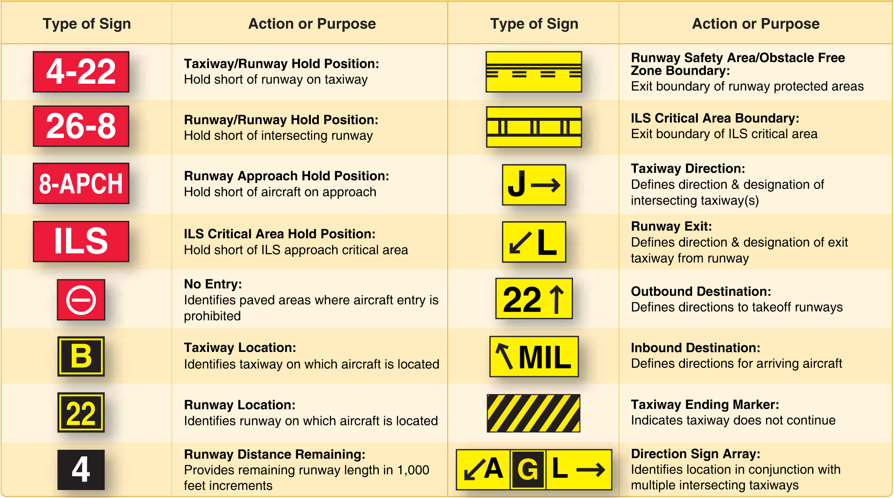

# How to Prepare for a checkride 

可以参考的视频

yt video: https://www.youtube.com/watch?v=xOnAX9pZTo8 

mock checkride video: https://www.youtube.com/watch?v=gO7sw1X7iME 

需要准备的清单

每次必备

* 充电宝

### Common Failure Points

* Getting Lost
* Following the "Megenta Line" -> especially the wrong one
* Getting bogged down in systems, fly the plane first
* Short Field Landings
* Busting Minimums  ??  For IFR
* Airspace knowledge !! 
* Aircraft Systems

adverse yaw: the airplane will initially yaw in the opposite direction of the bank 

in turning flight, the rudder's only function is to counteract the adverse yaw which happens when the airplane is rolled into a turn and when it's rolled back to  wings level flight 

flaps: the panels on the trailing edge of the inboard parts of the wings. 

flaps change the chord of the wing and increases both lift and drag. extending the flaps allows the landing approach to be steeper and slower. 

Look outside

凭感觉来做反应 因为你有reference 哪一些感觉是不可靠的 哪一些是可靠的 而且

When do you need a crosswind correction ? 

Taxi

Pattern work 

Take off  + Landing 

### The Overlooked Failure Items

* Emergency Procedures - Choosing an appropriate off-field landing site
* Partial Power Engine Emergencies - Think loss of power from a failed cylinder
* Non-Towered Airport Operations 
* Forward Slips to Landing
* VOR Navigation

先从大类分章节 开始准备,最后要筛选出重难点

大类包括

* Weather
* Regulations
* Airport Lighting + Marking + Flight Planning 
* Operation of Systems (Aircraft + Instrument)
* Aerodynamics

Why down elevator

后面来的tail wind , correction 是全部是朝向downwind, upwind是在同侧 elevator down 防止把尾巴吹翘起来

如果是前面来的 head wind, correction, upwind 是在风的来向 左边风 左边

left headwind correction, neutral + left 

right tailwind correction, push down + left

Right of Way Rules:

https://www.youtube.com/watch?v=Xak2gkqX6wQ

Missed Knowledge Test Question

* PA.I.C.K3f f. Clouds
* PA.I.E.K3 Special use airspace (SUA), special flight rules areas (SFRA), temporary flight restrictions (TFR), and other airspace areas.
* PA.I.F.K2f f. Weight and balance
  * CG

* PA.I.F.R2 Exceeding airplane limitations
  * Normal / Utility

* PA.I.G.K1h Pitot-static, vacuum/pressure, and associated flight instruments
  * Altitude Indicator
  * Airspeed Indicator
  * Vertical Speed Indicator
  * Heading Indicator
  * Turn Coordinator
  * Attitude Indicator

* PA.II.B.K1 Passenger briefing requirements, to include operation and required use of safety restraint systems.
* PA.III.A.K8 National Transportation Safety Board (NTSB) accident/incident reporting.

## 必须要背的

* Flight Plan 各种variable
* Airspace 的各种rule
* Weather 
  * 各种Weather的缩写
  * 
* 各种Manuever的动作要点, 常见错误, 评价标准

# Q&A

## Airworthiness Requirements

* Q: What are the required documents that must be onboard the aircraft before you can fly ? 
  * A: Airworthiness Certificate
  * R: Registration Certificate
  * R: Radio Station License (international flight only)
  * O: Operating Limitations
  * W: Weight and Balance Data
* What are the required inspections for your aircraft ? Show me that your aircraft meets inspection requirements and tell me when each inspection is due next. 
  * Annual Inspection
  * VOR Check
  * 100-Hour Inspection
  * Altimeter / Pitot-Static System Inspection
  * Transponder
  * Emergency Locator Transmitter (ELT)
  * Airworthiness Directives
  * Be able to go through the maintenance logs annd show all necessary inspections and next inspection dates
* Do you need a heading indicator for your flight ? How about an altimeter ? 
  * **ATOMATOFLAMES**: for Day VFR flight - A heading indicator is not required, but an altimeter is required

## Weather 

* What weather sources did you use to obtain your briefing for this flight ? What are other ways to obtain weather briefings ? 
  * 1-800-WXBRIEF (phone or website), Aviation Weather Center, ForeFlight
* Walk me throught your weather briefing
  * Be expected to run through your weather briefing, explaining TFRs, NOTAMS, AIRMETs, SIGMETs, PIREPs, METARs, TAFs
* What happens if the temperature and dew point are close together
  * Likely formation of visible moisture - fog, clouds, or dew  
* What kind of weather can you expect in a low-pressure system vs. a high-pressure system ? 
  * Low -> bad weather (cloudiness / precipitation)
  * High -> good weather (dissipation of cloudiness)

* What types of briefings can you obtain ? 

* What are some ways you can get weather information in-flight ? 

* Name and describe three different types of fog

* Describe the types of clouds, turbulence, precipitation, and visibility characteristic of stable and unstable air

* What conditions are necessary for structural icing to occur ? 

* Is frost on the wings dangerous ? Why ? 

* What factors are necessary for a thunderstorm to form ? 

* What do closely-spaced together isobards indicate ?

  

  

## Hunman Factors

* What is hypoxia ? What are the symptoms of hypoxia and how do you correct for it ? 
  * State of oxygen deficiency
  * Impaired judgment, memory, alertness, coordination. Headache, drowsiness, and dizziness
  * Descend or use supplemental oxygen

* What would you do if one of your passengers becomes extremely airsick?
  * Open up air vents, loosen clothing, use supplemental oxygen (if available), keep eyes on a point outside the aircraft
  * LAND

* What do you use to assess your fitness to fly ? 
  * I: Illness
  * M: Medication
  * S: Stress
  * A: Alcohol
    * 8 hours
    * No more than .04% BAC
  * Fatigue
  * Emotion / Eating

* What would you do if you accidentally entered a cloud and became disoriented
* Talk to me about how you can identify risks during your pre-flight planning process ? (PAVE) ? 

## Performance and Limitations

* Walk me through your takeoff and landing distance calculations
* Let's say your aircraft is overweight. What will this do to your aircraft's performance ? 
  * Higher takeoff speed
  * Longer takeoff run
  * Reduced rate and angle of climb
  * Lower maximum altitude
  * Shorter range
  * Reduced cruising speed / maneuverability
  * Higher stalling speed
* What will happend if your aircraft's CG is too far forward ? Too far aft ? Which is more dangerous ? 
  * Forward CG
    * Higher stall speed
    * Slower cruise speed
    * More stable
    * Greater back elevator pressure required
  * Aft CG (more dangerous)
    * Lower stall speed
    * Higher cruise speed
    * Less stable
* How does an airplane stall ? What are some common situations where you could accidentally stall an airplane ? 
  * Exceeding critical angle of attack (any airspeed, weight, load factor, or density altitude)
    * Over-rotation on takeoff or go-around (too much nose up trim)
    * Base to final turn
    * Impossible turn (engine failure after takeoff)

* Let's say you're on final at Ocean City but your controls suddenly feel very mushy and you hear a warning horn go off. What's happening ? 
* What is density altitude and why is it important to us ? What factors affect density altitude ? 
* Let's say there's an obstacle at the end of the runway. What speed would you pitch for after takeoff ? 
* What is the importance of the white arc on your airspeed indicator ? How about the red line ? Define each and also give values ? 
* Your airplane likes to turn left. Talk to me about the left-turning tendencies
* What is a spin ? How do you recover from one ? 

## Operations of Systems

* Talk to me about your aircraft's engine ?
  * Horizontally Opposed
  * Air Cooled 
  * Normally aspirated  
  * Direct Drive
  * Four-stoke, internal combustion, [reciprocating engines](https://en.wikipedia.org/wiki/Reciprocating_engine) that convert the back and forth motion of the pistons to the rotary motion of the [crankshaft](https://en.wikipedia.org/wiki/Crankshaft) 
* What is the vacuum system ? How does it work ? What instruments use it ? 
  * 2 vacuum pumps suck filtered air from the cabin through the gyroscopes of the attitude and heading indicators to allow the instruments to function correctly
  * Be able to walk through the diagram in the POH
* What is the pitot-static system ? How does it work ? What instruments use it ? 
* How is your cabin heated ? Are there any dangers about this system ? 
* What kind of fuel can your aircraft take ? What color is it ? 
* What does it mean if your ammeter is indicating a continuous discharge ? 
* What would you do if you have an engine failure during cruise ? 

## X/C Flight Planning and National Airspace System

* Besides completing a weather briefing to obtain NOTAMs and weather, what other pre-flight actions are required ? What actions do you personally do ? 
  * NOTAM
  * Weather reports and forecasts
  * Known ATC delays
  * Runway lengths of intended use
  * Alternatives available
  * Fuel requirements
  * Takeoff and landing distances

## 可以翻书查的

* 飞机注册相关的Regulation 
* 一些spatial illusion的名字

GARMIN 435 3-COM User Manual: https://static.garmin.com/pumac/190-01878-05_A.pdf

# Questions

## Maneuver

# Airman Certification Standards (ACS)

## I. Preflight Preparation

### A. Pilot Qualifications

**PA.I.A.K1 - Certification Requirements**

* 61.103 General

* 61.105 -> Ground knowledge 

* 61.107(b)(1) -> Required flight and ground training areas

* 61.109(a) -> How much flight time you need logged

**PA.I.A.K1 - Recent Flight Experience**

*  61.56 -> Flight Review
* 61.57 -> 90-Day Currentcy

**PA.I.A.K1 - Recordkeeping**

* 61.51 -> Logging ground and flight time
* 61.59 -> Logbook information falsification
* 61.60 -> Change of address

**PA.I.A.K2 Privileges and Limitations**

* 61.113 -> PIC Priv's and Limitations Pro Rata 
* 61.117 -> SIC Priv's and Limitations

**PA.I.A.K3 Medical Certificates**

* 61.23 Classes, Expiration Dates, Privileges, Limitations 

* 61.53 -> Temporary Medical Disqualifications

  

**PA.I.A.K4 Documents Required to exercise**

* 61.3 -> 
  * Pilot's Certificate
  * U.S. Government-issued photo ID
  * BasicMed Documents / Medical Certificate
  * Solo student must have endorsed logbook 

**PA.I.A.K5 **

### B. Airworthiness Requirements

Inspection: 

### C. Weather Information

### D. Cross-Country Flight Planning

* Basic Information
  * Airport 
    * Name
    * Frequency: ATIS/AWOS, Tower, Ground, Departure, Clearance
    * Sectional Chart
    * Airport Chart Supplement  
    * Weather https://www.aviationweather.gov/
  * Aircraft
    * Fuel: fuel reserve, fuel burning rate
    * Performance
      * speed: climb speed, descent speed, glide speed, cruise speed
    * Weight & Balance
    * Time: Arrival time, 
  * Navigation
    * Checkpoint
      * First checkpoint is critical, 尽量熟悉机场周围的环境
      * Daytime: VOR,  Lake , power line, highway, factory, stadium, Shopping mall, amusement park, railroad
      * Night: VOR, City Light, high way, small lakes, single mountain
    * Heading
      * Magnetic North / True North
    * VOR: 可以用来 locate + navigate 
      * Video: [VOR navigation EXPLAINED (easy)! by CAPTAIN JOE](https://www.youtube.com/watch?v=ZewYS4VlwNQ)
      * How to locate yourself ?
        * 确定你所在的radial
          * 调整OBS 指到center line, centerline 是可以覆盖两个radial的 确认你的OBS显示的是`FROM`, FROM 时候向上指的就是你所在的radial 可以理解成 VOR信号从 heading 比如下面的图表示就是你现在是在220 radial 上
          *  
      * How to nvaigate
        * 需要飞到VOR那个点上
          * 先确定你所在的radial(参考上面一步), 然后将VOR调整到TO, 向上指的就是你需要飞的heading  可以double check 应该是FROM heading 互为反向关系 (+-180) 
          * 下面的图就代表你要把heading 调整到40 飞到VOR
        * 需要飞到VOR一条特定的radial 上面: 保持Radial是IFR的基本技能，ATC可能会让你飞某一个特定radial 航向
      * radar上只能够显示你的plane location, 没有办法显示你的heading 所以Heading和Radial 之间可能有偏差 因为存在wind correction

关于VOR 

### E. National Airspace System

### F. Performance and Limitations

### G. Operations of Systems

### H. Human Factors

### 

## II. Preflight Procedures

### A. Preflight Assessment

### B. Flight Deck Management

### C. Engine Starting

### D. Taxiing

### F. Before Takeoff Check

## III. Airport and Seaplane Base Operations

### A. Communications, Light Signals, and Runway Lighting Sytems

### B. Traffic Patterns

### 

## IV. Takeoffs, Landings, and Go-Arounds

### A. Normal Takeoff and Climb

### B. Normal Approach and Landing

### C. Soft-Field Takeoff and Climb 

### D. Soft-Field Approach and Landing

### E. Short-Field Takeoff and Maximum Performance Climb

### F. Short-Field Approach and Landing

### M. Forward Slip to a Landing (斜着飞 快速Descent用的)

### N. Go-Around / Rejected Landing

## V. Performance and Ground Reference Maneuvers

### A. Steep Turns

### B. Ground Reference Maneuvers

### 

## VI. Navigation

### A. Pilotage and Dead Reckoning

### B. Navigation Systems and Radar Services

### C. Diversion 

### D. Lost Procedures

## VII. Slow Flight and Stalls

### A. Maneuvering During Slow Flight

### B. Power-Off Stalls

### C. Power-On Stalls

Setup:

* Clear the area
* Pick a visual reference point if maintaining heading
* Bank to maintain

Procedure

* Reduce power to 1500 RPM, slow to 60 MPH(Vx for short field take off) We use Vx immediately after takeoff to clear obstacles, followed by Vy to reach our cruising altitude quickly.
* Apply power to 2200 RPM, apply **right rudder** to maintain coordination
* Pitch up to maintain a slow, constant rate of deceleration
* Recognize and announce the signs of the approaching stall
* Stay coordinated, maintaining bank or heading
* 

### D. Spin Awareness

## VIII. Basic Instrument Maneuvers

### A. Straight-and-Level Flight

### B. Constant Airspeed Climbs

### C. Constant Airspeed Descents

### D. Turns to Headings

### E. Recovery from Unusual Flight Attitudes

### F. Radio Communications, Navigation Systems/Facilities, and Radar Services

## IX. Emergency Operations

### A. Emergency Descent

### B. Emergency Approach and Landing (Simulated)

### C. Systems and Equipment Malfunctions

### D. Emergency Equipment and Survival Gear

### E. Engine Failure During Takeoff Before 

### F. Engine Failure After Liftoff (Simulated)

### G. Approach and Landing with an Inoperative Engine

## XI. Night Operations

### A. Night Preparation

## XII. Postflight Procedures

### A. After Landing, Parking and Securing

基本名词解释 -> 看MIT Ground School Notes 

参考资料准备

* paper: 
  * 查regulation
  * 查基本词汇: MIT notes + handbook
  * 各种chart
    * aircraft performance chart 
    * airport supplement chart
    * sectional chart 
* digital: (TODO: 可以使用app吗)
  * foreflight ?
  * E6B calculator

## Takeoffs, Landings, and Go-Arounds

## Performance and Ground Reference Maneuvers

## 

### Power on stall

TODO:

各种manuvear

增加

准备

Weight / Balance 可能是比较薄弱的点

重新review之前Knowledge Test的错题 + Video 

Aviation Weather 应该是可以访问的

TODO:

需要更加精确的计算和控制 

先要熟悉基本参数 再加上临场的 各种动态参数
