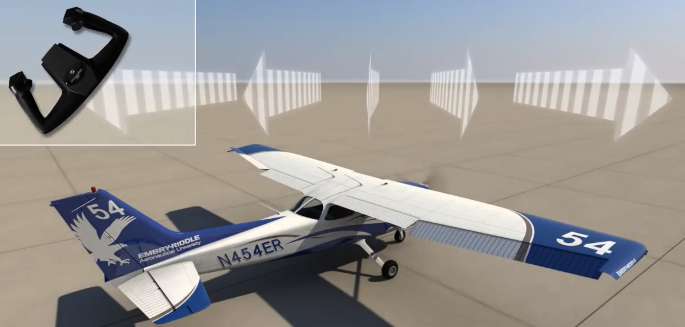

# How to Prepare for a check-ride 

* [How to prepare and pass your checkride – tips from a pilot examiner](https://www.youtube.com/watch?v=xOnAX9pZTo8 )
* MIT Private Pilot Ground School 
  * [Lecture Videos]( https://www.youtube.com/watch?v=jeI3wpulyPw&list=PLUl4u3cNGP63cUdAG3v311Vl72ozOiK25&index=1) 
  * [Lecture Notes](https://ocw.mit.edu/courses/aeronautics-and-astronautics/16-687-private-pilot-ground-school-january-iap-2019/lecture-notes/)

## Tools

* NOTAM Search: https://notams.aim.faa.gov/notamSearch/nsapp.html#/
* ForeFLight
  * [How I Use ForeFlight as a VFR Private Pilot | Part 1](https://www.youtube.com/watch?v=MFRoQrqvF30&ab_channel=MidlifePilot)
* GARMIN 435 3-COM User Manual: https://static.garmin.com/pumac/190-01878-05_A.pdf

* FAA official site: https://www.faa.gov/air_traffic/flight_info/aeronav/digital_products/dafd/ 

Short Field Landing

Emergency Descent

## 参考资料准备

* paper: 
  * 查regulation
  * 查基本词汇: MIT notes + handbook
  * 各种chart
    * aircraft performance chart 
    * airport supplement chart
    * sectional chart 
* digital
  * Foreflight
  * E6B calculator

## For Fun

* [Rare: U.S. Navy Blue Angels Preflight Brief in HD (July 2021)](https://www.youtube.com/watch?v=KlAPamTbryg&ab_channel=CharlesAtkeison) 
* [Aerobatic Champion Demonstrates Loops and Spins](https://www.youtube.com/watch?v=1tbOwRiV1QQ&ab_channel=SmithsonianNationalAirandSpaceMuseum)

Quiz: 

* In a turn, you must **apply back pressure on the elevator**

* **Attitude indicator** is used to verify and crosscheck the attitude of the airplane

* **The relationship between a point on the airplane and the horizon** is the primary reference for attitude when looking outside the airplane

* **The attitude** is the position of the airplane relative to the horizon.

* **The wings of the miniature airplane of the turn coordinator** is the primary reference for attitude when looking inside the airplane.

  

https://www.youtube.com/watch?v=FSl8iIpeHEk)

### Key Points

* Timezone -> sunset time
* Wind Triangle / Vector Analysis -> determine the heading 
* Flight Planning

## Q & A Buffer

Q: What is High pressure / Low pressure area ?

Q: How to crank the engine ? 

Q: Magnetic Heading 和 True Heading 有什么区别？ 

Q: set the high intensity runway lights 是直接可以由pilot进行的? 

A: Yes, press the radio call button 

Q: What is the induced drag: 

A: [汽车空气阻力分量中诱导阻力的实质究竟是什么？ - 公紫小桓的回答 - 知乎](https://www.zhihu.com/question/26372617/answer/1976934531)

Q: What is the dew point ?

Q: How do variations in temperature affect the altimeter?  

**Pressure levels are raised on warm days and the indicated altitude is lower than true altitude.**

# Oral

* [Private Pilot Checkride - Oral Exam - Full Version W/ Chapters](https://www.youtube.com/watch?v=eer36BT_V5I&list=WL&index=2&t=3223s)

## FAR 

### [Part 61.](https://www.ecfr.gov/current/title-14/chapter-I/subchapter-D/part-61)

* 61.3 Requirements for certificates, ratings, and authorizations
* 61.15 Offenses involving alcohol or drugs
* 61.23 Medical certificates: Requirement and duration
* 61.31 Type rating requirements, additional training, and authorization requirements
* 61.56 Flight review
* 61.57 Recent flight experience: Pilot in command
* 61.60 Change of address
* 61.69 Glider and unpowered ultralight vehicle towing: Experience and training requirements.
* 61.95 Operations in Class B airspace and at airports located within Class B airspace.
* 61.113 Private pilot privileges and limitations: Pilot in command.

### [Part 91.](https://www.ecfr.gov/current/title-14/chapter-I/subchapter-F/part-91) 

* 91.3 Responsibility and authority of the pilot in command
* 91.7 Civil aircraft airworthiness
* 91.9 Civil aircraft flight manual, marking, and placard requirements
* 91.15 Dropping objects
* 91.17 Alcohol of drugs
* 91.103 Preflight action
* 91.105 Flight crewmembers at stations
* 91.107 Use of safety belts, shoulder harnesses, and child restraint systems
* 91.111 Operating near other aircraft
* 91.113 Right-of-way rules: Except water operations
* 91.115 Right-of-way rules: Water operations
* 91.117 Aircraft speed
* 91.119 Minimum safe altitudes: General
* 91.121 Altimeter settings
* 91.123 Compliance with ATC clearances and instructions
* 91.125 ATC light signals
* 91.126 Operating on or in the vicinity of an airport in Class G airspace
* 91.127 Operating on or in the vicinity of an airport in Class E airspace
* 91.129 Operations in Class D airspace
* 91.130 Operations in Class C airspace
* 91.131 Operations in Class B airspace
* 91.135 Operations in Class A airspace
* 91.151 Fuel requirements for flight in VFR conditions
* 91.155 Basic VFR weather minimums
* 91.157 Special VFR weather minimums
* 91.159 VFR cruising altitude or flight level
* 91.203 Civil aircraft: Certifications required
* 91.205 Powered civil aircraft with standard category U.S airworthiness certificates: Instrument and equipment requirements  VFR 
* 91.207 Emergency locator transmitters
* 91.209 Aircraft lights
* 91.211 Supplemental oxygen
* 91.215 ATC transponder and altitude reporting equipment and use
* 91.303 Aerobatic flight
* 91.307 Parachutes and parachuting
* 91.309 Towing: Gliders and unpowered ultralight vehicles
* 91.313 Restricted category civil aircraft: Operating limitations
* 91.319 Aircraft having experimental certificates: Operating limitations
* 91.403 Maintenance, Preventive Maintenance, and Alterations General
* 91.405 Maintenance required
* 91.407 Operation after maintenance, preventive maintenance, rebuilding, or alteration
* 91.409 Inspections
* 91.413 ATC transponder tests and inspections
* 91.417 Maintenance records

## Notes

* MIT Private Pilot Ground School https://ocw.mit.edu/courses/aeronautics-and-astronautics/16-687-private-pilot-ground-school-january-iap-2019/lecture-notes/index.htm
* [Sporty's Private Pilot Training Course](https://dl.videos.sportys.com/onlinecourse/documents/privatestudyguide.pdf)

Manual

* GARMIN 435 3-COM User Manual: https://static.garmin.com/pumac/190-01878-05_A.pdf

## Abbreviation & Acronym

* **GS**: groundspeed GS determines the time the flight will take. -> gas consumption

* **TAS**: true airspeed no wind -> true airspeed == ground speed

* **WCA**(Wind Correction Angle):  

* **CTAF**: Common Traffic Advisory Frequency

* **UNICOM**: Universal Integrated Community , is a nongovernment air/ground radio communication station that may provide airport airport information

* **TAF**

  

## Concepts 

* **Pilotage**: navigation by reference to landmarks or checkpoints
* **Dead Reckoning**: navigation solely by means of computations based on time, airspeed, distance, and direction. the products derived from these variables, when adjusted by wind speed and velocity, are heading and GS.  
* **Variation**: the angle between TN and magnetic north(MN).
* **Course**: Intended path of an aircraft over the ground
* **Heading**: Direction in which the nose of the aircraft points during flight
* **Track**: 

* **Magnetic Deviation**:  

## Missed Knowledge Test Question

* PA.I.C.K3f f. Clouds
* PA.I.E.K3 Special use airspace (SUA), special flight rules areas (SFRA), temporary flight restrictions (TFR), and other airspace areas.
* PA.I.F.K2f f. Weight and balance
  * CG

* PA.I.F.R2 Exceeding airplane limitations
  * Normal / Utility

* PA.I.G.K1h Pitot-static, vacuum/pressure, and associated flight instruments
  * Altitude Indicator
  * Airspeed Indicator
  * Vertical Speed Indicator
  * Heading Indicator
  * Turn Coordinator
  * Attitude Indicator

* PA.II.B.K1 Passenger briefing requirements, to include operation and required use of safety restraint systems.
* PA.III.A.K8 National Transportation Safety Board (NTSB) accident/incident reporting.

# Q & A

## Weather

METAR example

Q: Describe the different types of fronts

A:

* Cold front: occurs when a mass of cold, dense, and stable air advances and replaces a body of warmer air
* Occluded front: A frontal occlusion occurs when a fast-moving cold front catches up with a slow-moving warm front.
* Warm front: The boundary area formed when a warm air mass contacts and flows over a colder air mass
* Stationery front: when the forces of two air masses are relatively equal

Q: What weather sources did you use to obtain your briefing for this flight ? What are other ways to obtain weather briefings ? 

* 1-800-WXBRIEF (phone or website), Aviation Weather Center, ForeFlight

Q: Walk me throught your weather briefing

* Be expected to run through your weather briefing, explaining TFRs, NOTAMS, AIRMETs, SIGMETs, PIREPs, METARs, TAFs

Q: What happens if the temperature and dew point are close together

A: Likely formation of visible moisture - fog, clouds, or dew  

Q: What kind of weather can you expect in a low-pressure system vs. a high-pressure system ? 

A; Low -> bad weather (cloudiness / precipitation) High -> good weather (dissipation of cloudiness)

Q: What types of briefings can you obtain ? 

A:

* Standard briefing: most complete, this type of  
* Outlook briefing: requested when a planned departure is 6 hours or more away. 
* Abbreviated Briefing: a shortened version of the standard briefing. It should be requested when a departure has been delayed or when weather information is need to update the previous briefing.

Q: What are some ways you can get weather information in-flight ? 

Q: Name and describe three different types of fog

* Describe the types of clouds, turbulence, precipitation, and visibility characteristic of stable and unstable air

* What conditions are necessary for structural icing to occur ? 

* Is frost on the wings dangerous ? Why ? 

* What factors are necessary for a thunderstorm to form ? 

  

  What do closely-spaced together isobards indicate ?

Q: wind drift correction

* Taxi
* Maneuvers / Pattern work 
* Take off  + Landing 
* Stashed changes

## Airport Lighting + Marking + Signage

### Tips

* 同一个方向的Runway 可以用后缀来区分 L(Left), C(Center), R(Right)

* 注意提前看好Runway 的宽度，因为会有illusion, 宽的跑道让你感觉离地面更近，窄的跑道让你觉得离地面更高

[Airport Markings](https://www.youtube.com/watch?v=MrrL92AH23A)

[Airport Signage](https://www.youtube.com/watch?v=VCDo9xJk4YE)

* Mandatory Instruction Signs
* Location Signs
* Direction Signs
* Runway Distance Remaining Signs
* Information Signs
* Destination Signs

## Operation of Systems (Aircraft + Instrument)

Q: What is magneto and what is spark ? 

### Aerodynamics

Q: Four forces 

A:

* Thrust
* Drag
* Lift:
* Weight

adverse yaw: the airplane will initially yaw in the opposite direction of the bank 

in turning flight, the rudder's only function is to counteract the adverse yaw which happens when the airplane is rolled into a turn and when it's rolled back to  wings level flight 

flaps: the panels on the trailing edge of the inboard parts of the wings. 

flaps change the chord of the wing and increases both lift and drag. extending the flaps allows the landing approach to be steeper and slower. 

Look outside

凭感觉来做反应 因为你有reference 但是需要区分一下哪些感觉是不可靠的 哪些是可靠的 而且

When do you need a crosswind correction ? 

Taxi

Pattern work 

Take off  + Landing 

Why down elevator ? 

Right of Way Rules: Part 91.113 

https://www.youtube.com/watch?v=Xak2gkqX6wQ

## 必须要背的

* Flight Plan 各种variable

* Airspace 的各种rule

* Weather 
  * 各种Weather的缩写
  
  

## Airworthiness Requirements

* Q: What are the required documents that must be onboard the aircraft before you can fly ? 
  * A: Airworthiness Certificate
  * R: Registration Certificate
  * R: Radio Station License (international flight only)
  * O: Operating Limitations
  * W: Weight and Balance Data
* What are the required inspections for your aircraft ? Show me that your aircraft meets inspection requirements and tell me when each inspection is due next. 
  * Annual Inspection
  * VOR Check
  * 100-Hour Inspection
  * Altimeter / Pitot-Static System Inspection
  * Transponder
  * Emergency Locator Transmitter (ELT)
  * Airworthiness Directives
  * Be able to go through the maintenance logs annd show all necessary inspections and next inspection dates
* Do you need a heading indicator for your flight ? How about an altimeter ? 
  * **ATOMATOFLAMES**: for Day VFR flight - A heading indicator is not required, but an altimeter is required

## Weather 

* 
  
  
  
  

## Hunman Factors

* What is hypoxia ? What are the symptoms of hypoxia and how do you correct for it ? 
  * State of oxygen deficiency
  * Impaired judgment, memory, alertness, coordination. Headache, drowsiness, and dizziness
  * Descend or use supplemental oxygen

* What would you do if one of your passengers becomes extremely airsick?
  * Open up air vents, loosen clothing, use supplemental oxygen (if available), keep eyes on a point outside the aircraft
  * LAND

* What do you use to assess your fitness to fly ? 
  * I: Illness
  * M: Medication
  * S: Stress
  * A: Alcohol
    * 8 hours
    * No more than .04% BAC
  * Fatigue
  * Emotion / Eating

* What would you do if you accidentally entered a cloud and became disoriented
* Talk to me about how you can identify risks during your pre-flight planning process ? (PAVE) ? 

## Performance and Limitations

* Walk me through your takeoff and landing distance calculations
* Let's say your aircraft is overweight. What will this do to your aircraft's performance ? 
  * Higher takeoff speed
  * Longer takeoff run
  * Reduced rate and angle of climb
  * Lower maximum altitude
  * Shorter range
  * Reduced cruising speed / maneuverability
  * Higher stalling speed
* What will happend if your aircraft's CG is too far forward ? Too far aft ? Which is more dangerous ? 
  * Forward CG
    * Higher stall speed
    * Slower cruise speed
    * More stable
    * Greater back elevator pressure required
  * Aft CG (more dangerous)
    * Lower stall speed
    * Higher cruise speed
    * Less stable
* How does an airplane stall ? What are some common situations where you could accidentally stall an airplane ? 
  * Exceeding critical angle of attack (any airspeed, weight, load factor, or density altitude)
    * Over-rotation on takeoff or go-around (too much nose up trim)
    * Base to final turn
    * Impossible turn (engine failure after takeoff)

* Let's say you're on final at Ocean City but your controls suddenly feel very mushy and you hear a warning horn go off. What's happening ? 
* What is density altitude and why is it important to us ? What factors affect density altitude ? 
* Let's say there's an obstacle at the end of the runway. What speed would you pitch for after takeoff ? 
* What is the importance of the white arc on your airspeed indicator ? How about the red line ? Define each and also give values ? 
* Your airplane likes to turn left. Talk to me about the left-turning tendencies
* What is a spin ? How do you recover from one ? 

## Operations of Systems

* Talk to me about your aircraft's engine ?
  * Horizontally Opposed
  * Air Cooled 
  * Normally aspirated  
  * Direct Drive
  * Four-stoke, internal combustion, [reciprocating engines](https://en.wikipedia.org/wiki/Reciprocating_engine) that convert the back and forth motion of the pistons to the rotary motion of the [crankshaft](https://en.wikipedia.org/wiki/Crankshaft) 
* What is the vacuum system ? How does it work ? What instruments use it ? 
  * 2 vacuum pumps suck filtered air from the cabin through the gyroscopes of the attitude and heading indicators to allow the instruments to function correctly
  * Be able to walk through the diagram in the POH
* What is the pitot-static system ? How does it work ? What instruments use it ? 
* How is your cabin heated ? Are there any dangers about this system ? 
* What kind of fuel can your aircraft take ? What color is it ? 
* What does it mean if your ammeter is indicating a continuous discharge ? 
* What would you do if you have an engine failure during cruise ? 

Q: Different type of airspeeds

A: 

* Indicated Airspeed (IAS): read right off your airspeed indicator
* True Airpseed(TAS): the speed of your aircraft relative to the air it's flying through. As you climb, true airspeed is higher than your indicated airspeed. Pressure decreases with higher altitudes, so for any given true airspeed, as you climb, fewer and fewer air molecules will enter the pitoto tubde.  1000 feet -> 2% higher
* Groundspeed (GS): The movement of your airplane relative to the ground. It's true airspeed corrected for wind. e.g. TAS 100 knots + tailwind of 20 knots, GS = 120 knots
* Calibrated Airspeed (CAS): indicated airspeed corrected for instrument and positional errors.  ISA conditions (15 degrees Celsius + 29.92 inches of mercury, 0% humidity)

## X/C Flight Planning and National Airspace System

* Class B 需要clearance, 必须十分明确的表示 `request clearance into the Class Bravo`

* Besides completing a weather briefing to obtain NOTAMs and weather, what other pre-flight actions are required ? What actions do you personally do ? 
  * NOTAM
  * Weather reports and forecasts
  * Known ATC delays
  * Runway lengths of intended use
  * Alternatives available
  * Fuel requirements
  * Takeoff and landing distances
* Class G Air of 14,500 Feet MSL, everything above 14,500 feet MSL is Class E excluding everything above  17999, 
* Airspace Cloud Requirements
  * 

* IMSAFE Checklist
  * Illness
  * Medication
  * Stress
  * Alcohol
  * Fatigue
  * Eating / Emotion

* PAVE Checklist
  * Pilot
  * Aircraft
  * Environment
  * External Pressures  

* Cloud Ceiling: the height above the earth's surface of the lowest layer of clouds or obscuring phenomena, reported as **broken, overcast, obscuration** and not classified as thin or partial

## 可以翻书查的

* 飞机注册相关的Regulation 
* 一些spatial illusion的名字

# Questions

## Maneuver

# Airman Certification Standards (ACS)

## I. Preflight Preparation

### A. Pilot Qualifications

**PA.I.A.K1 - Certification Requirements**

* 61.103 General

* 61.105 -> Ground knowledge 

* 61.107(b)(1) -> Required flight and ground training areas

* 61.109(a) -> How much flight time you need logged

**PA.I.A.K1 - Recent Flight Experience**

*  61.56 -> Flight Review
* 61.57 -> 90-Day Currentcy

**PA.I.A.K1 - Recordkeeping**

* 61.51 -> Logging ground and flight time
* 61.59 -> Logbook information falsification
* 61.60 -> Change of address

**PA.I.A.K2 Privileges and Limitations**

* 61.113 -> PIC Priv's and Limitations Pro Rata 
* 61.117 -> SIC Priv's and Limitations

**PA.I.A.K3 Medical Certificates**

* 61.23 Classes, Expiration Dates, Privileges, Limitations 

* 61.53 -> Temporary Medical Disqualifications

  

**PA.I.A.K4 Documents Required to exercise**

* 61.3 -> 
  * Pilot's Certificate
  * U.S. Government-issued photo ID
  * BasicMed Documents / Medical Certificate
  * Solo student must have endorsed logbook 

**PA.I.A.K5 **

### B. Airworthiness Requirements

Inspection: 

### C. Weather Information

### D. Cross-Country Flight Planning

* Basic Information
  * Airport 
    * Name
    * Frequency: ATIS/AWOS, Tower, Ground, Departure, Clearance
    * Sectional Chart
    * Airport Chart Supplement  
    * Weather https://www.aviationweather.gov/
  * Aircraft
    * Fuel: fuel reserve, fuel burning rate
    * Performance
      * speed: climb speed, descent speed, glide speed, cruise speed
    * Weight & Balance
    * Time: Arrival time, 
  * Navigation
    * Checkpoint
      * First checkpoint is critical, 尽量熟悉机场周围的环境
      * Daytime: VOR,  Lake , power line, highway, factory, stadium, Shopping mall, amusement park, railroad
      * Night: VOR, City Light, high way, small lakes, single mountain
    * Heading
      * Magnetic North / True North
    * VOR: 可以用来 locate + navigate 
      * Video: [VOR navigation EXPLAINED (easy)! by CAPTAIN JOE](https://www.youtube.com/watch?v=ZewYS4VlwNQ)
      * How to locate yourself ?
        * 确定你所在的radial
          * 调整OBS 指到center line, centerline 是可以覆盖两个radial的 确认你的OBS显示的是`FROM`, FROM 时候向上指的就是你所在的radial 可以理解成 VOR信号从 heading 比如下面的图表示就是你现在是在220 radial 上
          *  
      * How to nvaigate
        * 需要飞到VOR那个点上
          * 先确定你所在的radial(参考上面一步), 然后将VOR调整到TO, 向上指的就是你需要飞的heading  可以double check 应该是FROM heading 互为反向关系 (+-180) 
          * 下面的图就代表你要把heading 调整到40 飞到VOR
        * 需要飞到VOR一条特定的radial 上面: 保持Radial是IFR的基本技能，ATC可能会让你飞某一个特定radial 航向
      * radar上只能够显示你的plane location, 没有办法显示你的heading 所以Heading和Radial 之间可能有偏差 因为存在wind correction

### E. National Airspace System

### F. Performance and Limitations

### G. Operations of Systems

### H. Human Factors

## II. Preflight Procedures

### A. Preflight Assessment

### B. Flight Deck Management

* 手机Foreflight 导航
* Kneeboard
* Sentry ADS-B
* 

### C. Engine Starting

### D. Taxiing

后面来的tail wind , correction 是全部是朝向downwind, upwind是在同侧 elevator down 防止把尾巴吹翘起来

如果是前面来的 head wind, correction, upwind 是在风的来向 左边风 左边

left headwind correction, neutral + left 

right tailwind correction, push down + left

### F. Before Takeoff Check

## III. Airport and Seaplane Base Operations

### A. Communications, Light Signals, and Runway Lighting Sytems

### B. Traffic Patterns

## IV. Takeoffs, Landings, and Go-Arounds

### A. Normal Takeoff and Climb

### B. Normal Approach and Landing

### C. Soft-Field Takeoff and Climb 

### D. Soft-Field Approach and Landing

### E. Short-Field Takeoff and Maximum Performance Climb

### F. Short-Field Approach and Landing

### M. Forward Slip to a Landing (斜着飞 快速Descent用的)

### N. Go-Around / Rejected Landing

## V. Performance and Ground Reference Maneuvers

### A. Steep Turns

### B. Ground Reference Maneuvers

## VI. Navigation

### A. Pilotage and Dead Reckoning

### B. Navigation Systems and Radar Services

### C. Diversion 

### D. Lost Procedures

## VII. Slow Flight and Stalls

### A. Maneuvering During Slow Flight

### B. Power-Off Stalls

### C. Power-On Stalls

Setup:

* Clear the area
* Pick a visual reference point if maintaining heading
* Bank to maintain

Procedure

* Reduce power to 1500 RPM, slow to 60 MPH(Vx for short field take off) We use Vx immediately after takeoff to clear obstacles, followed by Vy to reach our cruising altitude quickly.

* Apply power to 2200 RPM, apply **right rudder** to maintain coordination

* Pitch up to maintain a slow, constant rate of deceleration

* Recognize and announce the signs of the approaching stall

* Stay coordinated, maintaining bank or heading

  

### D. Spin Awareness

## VIII. Basic Instrument Maneuvers

### A. Straight-and-Level Flight

How to level the airplane? 

level的前置动作一定是climb / descent 在 climb 或 descent过程中会有trim的调整，正确的做法是 快要level的时候 push / pull yoke 达到你想要的速度，调整power 

yoke -> power -> trim  最后的状态是松手之后还是level flight

不要在低头的时候 把手放在yoke上 会不自觉的让飞机转向

### B. Constant Airspeed Climbs

### C. Constant Airspeed Descents

### D. Turns to Headings

### E. Recovery from Unusual Flight Attitudes

### F. Radio Communications, Navigation Systems/Facilities, and Radar Services

## IX. Emergency Operations

### A. Emergency Descent

### B. Emergency Approach and Landing (Simulated)

### C. Systems and Equipment Malfunctions

### D. Emergency Equipment and Survival Gear

### E. Engine Failure During Takeoff Before 

### F. Engine Failure After Liftoff (Simulated)

### G. Approach and Landing with an Inoperative Engine

## XI. Night Operations

### A. Night Preparation

## XII. Postflight Procedures
### A. After Landing, Parking and Securing 

# Practical

How to use ForeFlight when you are in the air? 

Weather
Track Logging 
Flight Plan

Primary Flight Controls
	* alierons - Roll
	* elevator / stabilator - Pitch
	* rudder - Yaw 

## Common Failure Points

* Getting Lost
* Following the "Megenta Line" -> especially the wrong one
* Getting bogged down in systems, fly the plane first
* Short Field Landings
* Busting Minimums  ??  For IFR
* Airspace knowledge !! 
* Aircraft Systems

## The Overlooked Failure Items

* Emergency Procedures - Choosing an appropriate off-field landing site
* Partial Power Engine Emergencies - Think loss of power from a failed cylinder
* Non-Towered Airport Operations 
* Forward Slips to Landing
* VOR Navigation

## Tips

* 先要熟悉基本参数(performance, 各种V speed) 再加上临场环境的各种动态参数(wind direction, reference point, altimeter) 来进行精确的操作

* 

