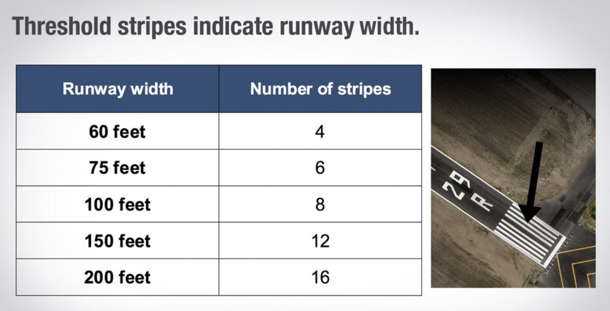
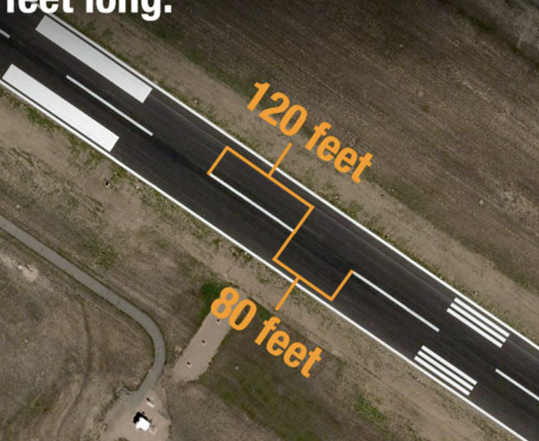

## High Altitude Maneuvers

2500AGL -> 3500 MSL for KEQY

Slow Flight

* 1500 RPM
* airspeed 60
* maintain the heading
* Flaps down to Full Flap
* Add some power to maintain altitude

Power Off Stall (Landing Configuration)

* 前半部分和Slow Flight 完全一致 Landing approach speed

* Full Flap

* Recover
  * Pitch down + Add power

Power On 

* No Flap
* 1700 RPM -> slow down to 

Low Altitude 在哪个高度? 1500 AGL 2500 MSL for KEQY

Turn Around a Point

* 确定好一个点 大小要适中 
  * 可以选择的点: 卡车 小房子 大树
  * 不要选的点: 信号塔(空心不好观察相对位置) 湖面(面积太大)

* 如果是越来越远 -> Steeper turn
* 如果越来越近 -> Shallower turn

# Landing & Takeoff

Power for Altitude -> If you are too high, power out, If you are too low, add power

Pitch for airspeed -> Maintain stable airspeed, pitch for visibility

Establish the approach

Altimeter 

Performance:

Landing Distance / Takeoff Distance 

Calculator

Sight Picture:

* Aiming Point
* Touchdown Point
* 接近的时候余光看两侧
* Touch down 之前目光放远一些

### Soft Field Landing

因为加了Flap 可以更快flare 但是climb performance会变差, more drag

* Flap 10 -> no obstacle 
* No Flap -> with obstacle 

### Short Field Landing

在Final Turn 之前都是Normal Landing Procedure, 

1000 foot mark 开始config, Carb heat out, power 1700 RPM, Flap 10 degree (make sure your airspeed is below 100)

Base: Flap 20

Final: Flap 30 

Final 的时候airspeed 稍微低一些70 或者65 这样flare的时候distance会短一些

Maximum Brake: 

* Flap Full
* Brake 踩到底

 The runway aiming points(commonly called the 1000 foot markers) are **150 feet long and 20 feet wide**. If a runway is shorter than 4,200 feet, the aiming points may be shortened to 100 feet in length

 The threshold markings are 150 feet long and 5.75 feet wide.

Eric:

* Aiming Point 是Number

* 在Number的时候如果感觉离地面较低 可以加power 然后gain altitude

* 在Final的时候如果 Power out  

飞到了Aiming point 之后要做什么? 直接Flare

在Final的时候 

Pick up a random touchdown point

touchdown point 之前400 - 500 feet

touch down: 1000 feet mark, ai

开始flare nose up ? 

45度 Runway进行Base Turn

Final Turn

Question

Aiming Point 要在Touch down 之前 可以用两个Stripe

### Emergency Landing 

* No Power / Simulated Idle Power
* Pick up a landing point
* Best glide speed - checklist POH 80 MPH
* Turn to point
* No Flap 
* Optional: Check list

### Emergency Descent 

* No Power
* 45度 Bank Angle Nose down (右侧Engine Fire 往左Turn)
* 125 knot Pitch Altitude 
* 360 度 Steep Turn 
* Pattern Altitude (1500Feet AGL) -> Prepare for landing

Soft Field Landing

* Normal Landing 
* Keep the nose up

Forward Slip:

* Power Idle
* Full Rudder
* Opposite Alieron -> ()
* Descent Rate 能够达到15 甚至20

Crosswind Landing 

Side Slip

* Point the Alieron to the direction you want to go / wind  
* Opposite rudder to maintain straight way

Extend Final 什么时候开始Config 

Aiming Point 移动来判断Final 是高是低

今天extend downwind 

进行radio call 

https://www.boldmethod.com/learn-to-fly/maneuvers/how-to-fly-a-forward-slip-to-landing-if-you-are-high-on-final/

还是会有

Takeoff 犯过的错误

* 没有crosswind correction
* 偏离run way
* 没有maintain $V_y$ Or $V_x$
* Rotate 过慢
  * Strong head wind的时候 可以早rotate
* Rotate 过快
  * 被groud effect 托起来之后有一些错觉

Landing 犯过的错误

* Flare 距离地面的高度过高
  * 需要
  * 注意不同Runway 的宽窄会有视觉上的错觉
* Crosswind Correction
* Airspeed too slow / too high
  * 没有注意Airspeed Indicator 分心看窗外的Traffic
  * 
* 有Headwind 的时候没有增加power 和 airspeed
* 没有用Flap 导致air
* Final Overshoot 
  * Base turn的时候bank angle too shallow
* Final Approach Altitude too low 
  * 可能是在Final的时候
* Final Approach Altitude too high
* 使用Pitch来调高度
  * 这是必须要避免的大问题，Power -> Altitude, Pitch -> Airspeed. 如果要增加Altitude 必须增加Power
* Miss my landing point
  * Short field landing 时候airspeed 过快
  * aiming point 选的有问题 
  * altitude too high
* Flare 的时候拉yoke 过快/过狠 导致了float 降下来之后又飞起来
* 没有stabilized approach
  * 反复在
* Strong headwind 可以少用Flap
* Mess up the radio call
  * 多发生在towered airport 没有听清楚command 没有搞清楚runway number
