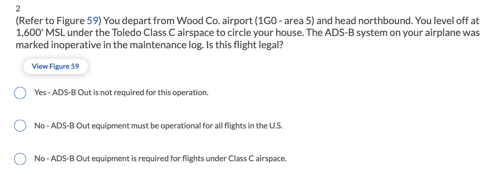
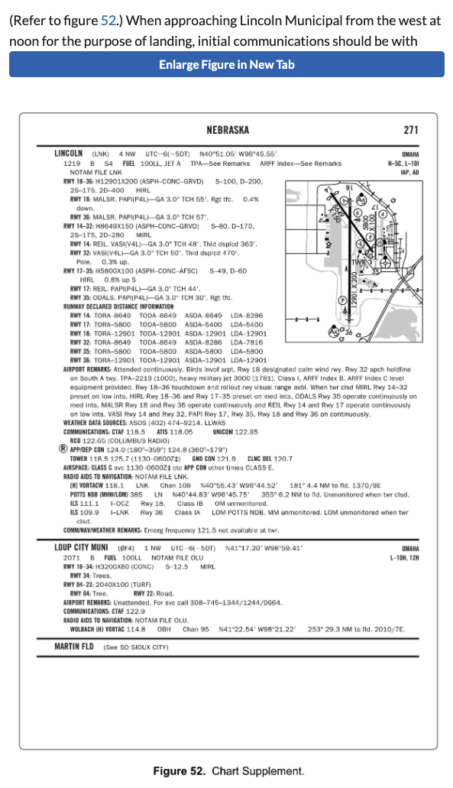
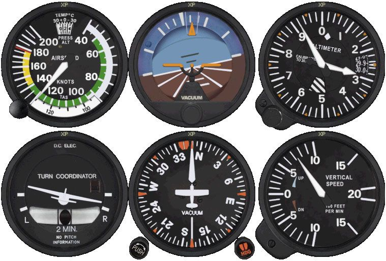

## 2-26 mock test

Flight Planning ? 

距离怎么看? 风速 + 风向 对于飞行时间的影响? 

power-off-stalling speed ? 

power-on-stalling speed ? 

* Q2: Automatic Dependent Surveillance-Broadcast(ADS-B) Out equipment and use explanation: Flight below the floor of Class C airspace is permitted without ADS-B Out equipment installed.

* Q6: Read the Weather Depiction Chart 没有给标记出来不同state的名字? 

* Q7 cumulonimbus clouds formation conditons = lifting action + ??

* Q8: according to flight map, the vertical limits of Class E airspace

* Q9: aircraft equipped with fuel pumps, when is the auxiliary electric driven pump used ? 

* Q10: unstable air mass is forced upward, what type clouds can be expected ? 

* Q11: Landing map 

* Q12: On landing, your tire blows and the wheel is dented. What action is required to comply with NTSB Part 830? **No notification or report is required**

* Q14: floor of the Class E airspace

* Q17: **"No SVFR"**

* Q18: 4,500 feet MSL to ATC: `FOUR THOUSAND FIVE HUNDRED` 

  * For reporting altitudes and flight levels, say each number followed by thousand or hundred
  * e.g. 12,000  `ONE TWO THOUSAND`
  * 12,500 `ONE TWO THOUSAND FIVE HUNDRED`

* Q19: To act as pilot in command of an aircraft carrying passengers, the pilot must have made three takeoffs and three landings within the preceding 90 days in an aircraft of the same **category, class, and type, if a type rating is required.**

* Q22: Absence of the sky condition and visibility on an ATIS broadcast indicates that **the ceiling is at least 5,000 feet and visibility is 5 miles or more.**

* Q25  **When approaching from 270° at noon, use the Lincoln Approach Control for 180°-359°. This would be 124.0 MHz.**  

* CTAF ATIS UNICON ? 

* Q28: The required documents necessary to be onboard the airplane include: **Airworthiness Certificate, Registration, and Operating Handbook.**

* Q33: In which environment is aircraft structural ice most likely to have the highest accumulation rate ? **[Freezing rain]**(https://www.youtube.com/watch?v=DyHC1J9XQM4) 

* Q34: There is no **acceleration/deceleration error** [这是什么]?? on a heading of ??

* Q35: What is the approximate position of the aircraft ? 

* Q36: A flashing white light signal from the control tower to a taxiing aircraft is an indication to ??

* Q37: In order to check your progress when using **dead reckoning**[这是什么] with no radio instrumentation, make corrections by: ??? 

* Q40: For internal cooling, reciprocating aircraft engines are especially dependent on **the circulation of lubricating oil.****

  Airflow over the cylinders and other parts of the engine provides some measure of cooling. Additional heat is absorbed by the oil and carried to the oil cooling system for dissipation.

* Q41. density altitude vs. pressure altitude ??

* Q42. Deviation error of the magnetic compass is caused by ?

* Q43. The VOR receiver ? What radial is the aircraft crossing ?  What does this mean ? f 

* Q45 To get a complete weather briefing for the planned flight, the pilot should request ??

* Q48: 读图

* Q49: The wind condition that requires maximum caution when avoiding wake turbulence on landing is a ?? 

* Q50: 

* Q54: To operate at night in Class E airspace

* Q56: Which basic flight maneuver increase the load factor ?  **Turns.**

  Coordinated, level turns increase the load factor. Additional lift must be generated as the total lift becomes divided between horizontal and vertical components. The vertical component must be equal to the weight of the aircraft to maintain level flight.

* 

speed indicator

attitude indicator

altimeter

turn and bank indicaor / turn coordinator

heading indicator

vertical speed indicator